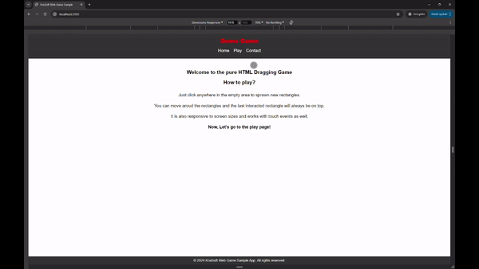

This is a demo app for a simple HTML game using [Next.js](https://nextjs.org/) project bootstrapped with [`create-next-app`](https://github.com/vercel/next.js/tree/canary/packages/create-next-app).

## Getting Started

First, run the development server:

```bash
npm run dev
# or
yarn dev
# or
pnpm dev
# or
bun dev
```

Open [http://localhost:3000](http://localhost:3000) with your browser to see the app.

The rectagle are positioned absolute and we just need to keep track of x,y postion for newly spawned rectangles.
CSS @keyframe animation is used from top left position to the clicked location. The last interacted item will have the highest z-index. Mobile touch events are also handled.



## Learn More

Getting to know more about me:

- feel free to chat with me at kyithar@outlook.com
- your feedback and contributions are welcome!

